# DB Performance Metrics
--------------
# Introduction

This project is a Java application developed with the Spring Boot framework and managed with Maven. Its primary objective is to conduct performance testing on two different databases: MongoDB and Oracle. For each database, CRUD (Create, Read, Update, Delete) operations have been optimized to achieve the best possible results.

For the Oracle database, two different implementations are used: JPA (Java Persistence API) and JDBC (Java Database Connectivity). JPA is a data persistence standard in Java that allows mapping objects to relational database tables. JDBC is an API that enables the execution of SQL operations in Java.

For MongoDB, MongoRepository and MongoTemplate are used. MongoRepository is a Spring Data interface that provides CRUD and query methods for interacting with MongoDB. MongoTemplate is a helper class that provides high-level methods for interacting with MongoDB. It also uses the MongoDB Java driver for database-level interaction.

The project is set up to connect to the databases through Spring Boot configuration and application properties. The necessary dependencies for the project are defined in the `pom.xml` file. The databases are created and accessed using Docker.

In addition, the project utilizes Insomnia to execute queries and obtain the results. Insomnia is a powerful tool that provides a user-friendly interface for executing queries and visualizing the results, making it easier to understand the performance of the databases. 

Performance testing is conducted by measuring the time it takes for CRUD operations to execute on each database. The results of these tests provide valuable insight into how these databases perform under different workloads and can help make informed decisions about which database to use based on the specific needs of the application.

The application includes:
- Database Connectivity 
- CRUD Operations
- Different Implementations Database
- Performance Operations
- Insomnia
- Maven Project 
- Java and Spring Boot
- Clear Code Structure
---------------

## Contents

### Controllers
#### CRUD
- [PerformanceCreateController](#create-controller)
- [PerformanceReadController](#read-controller)
- [PerformanceUpdateController](#update-controller)
- [PerformanceDeleteController](#delete-controller)
#### MongoDB
- [MongoDBUserController](#mongoDB-controller)
#### Oracle
- [OracleUserController](#oracle-controller)

### Config
- [Docker](#docker)
- [Insomnia](#insomnia)
-----------

## Create Controller

### **Save All Users Empty Collection**
Performs a save operation to store a complete user record in a empty database, and calculates the average execution time.
#### Request
```
[GET] http://localhost:8080/api/v1/performance/saveAllUsersEmptyCollection
```
#### Response
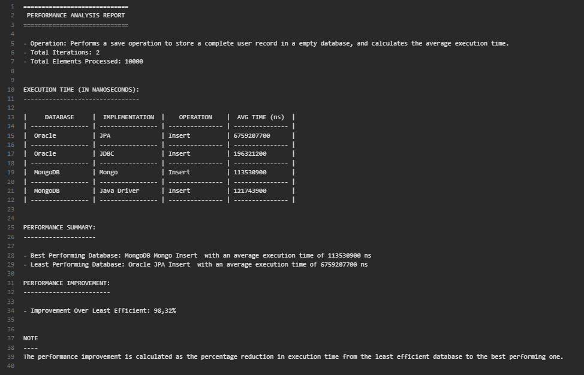

### **Save User Full Collection**
Performs a save operation to store a single user record in a full database, and calculates the average execution time.
#### Request
```
[GET] http://localhost:8080/api/v1/performance/saveUserFullCollection
```
#### Response
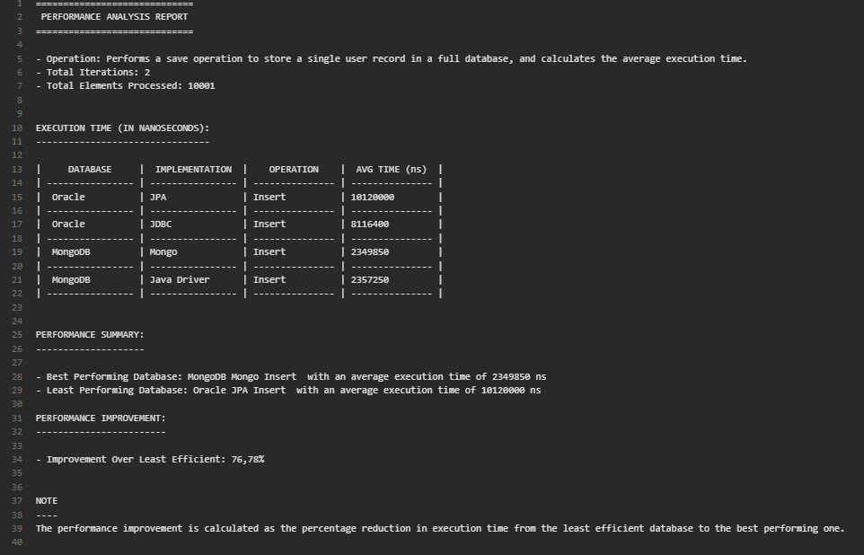

### **Compare Upsert Insert**
Performs a comparison of upsert versus insert operations for user saving in the database, and calculates the average execution time.
#### Request
```
[GET] http://localhost:8080/api/v1/performance/compareUpsertInsert
```
#### Response
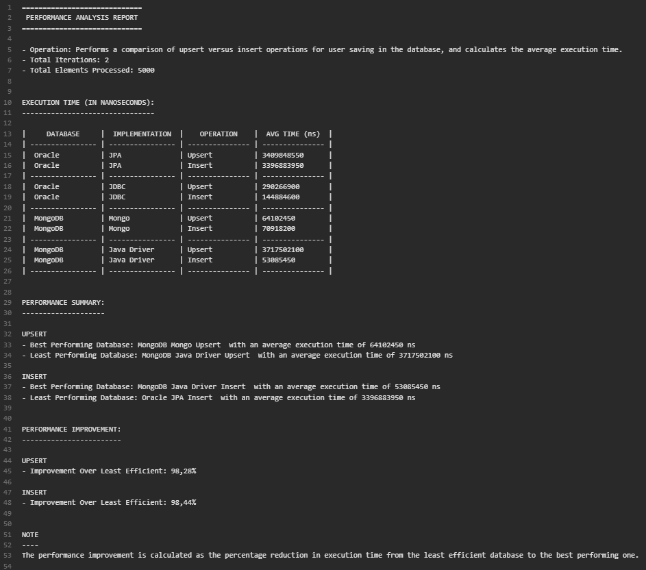

## Read Controller

### **Find All Users **
Performs a read operation to retrieve all users record by a non-indexed field at different positions (first, middle, last) in the database, and calculates the average execution time.
#### Request
```
[GET] http://localhost:8080/api/v1/performance/findAllUsers
```
#### Response
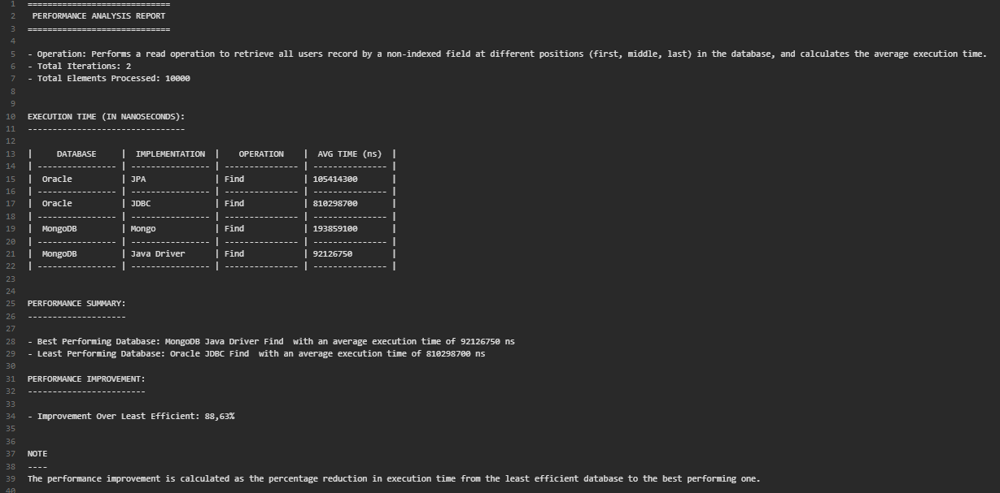

### **Find User By Indexed Field **
Performs a read operation to retrieve a complete user record by a indexed field at different positions (first, middle, last) in the database, and calculates the average execution time.
#### Request
```
[GET] http://localhost:8080/api/v1/performance/findUserByIndexedField
```
#### Response
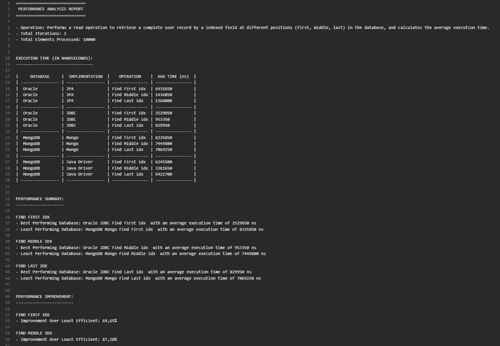

### **Find User By Non Indexed Field **
Performs a read operation to retrieve a complete user record by a non-indexed field at different positions (first, middle, last) in the database, and calculates the average execution time.
#### Request
```
[GET] http://localhost:8080/api/v1/performance/findUserByNonIndexedField
```
#### Response
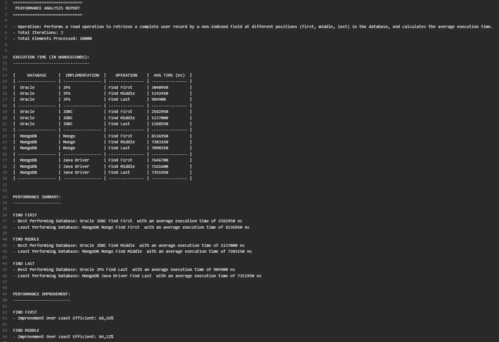

### **Find User Field By Indexed Field **
Performs a read operation to retrieve a complete user record by a indexed field at different positions (first, middle, last) in the database, and calculates the average execution time.
#### Request
```
[GET] http://localhost:8080/api/v1/performance/findUserFieldByIndexedField
```
#### Response
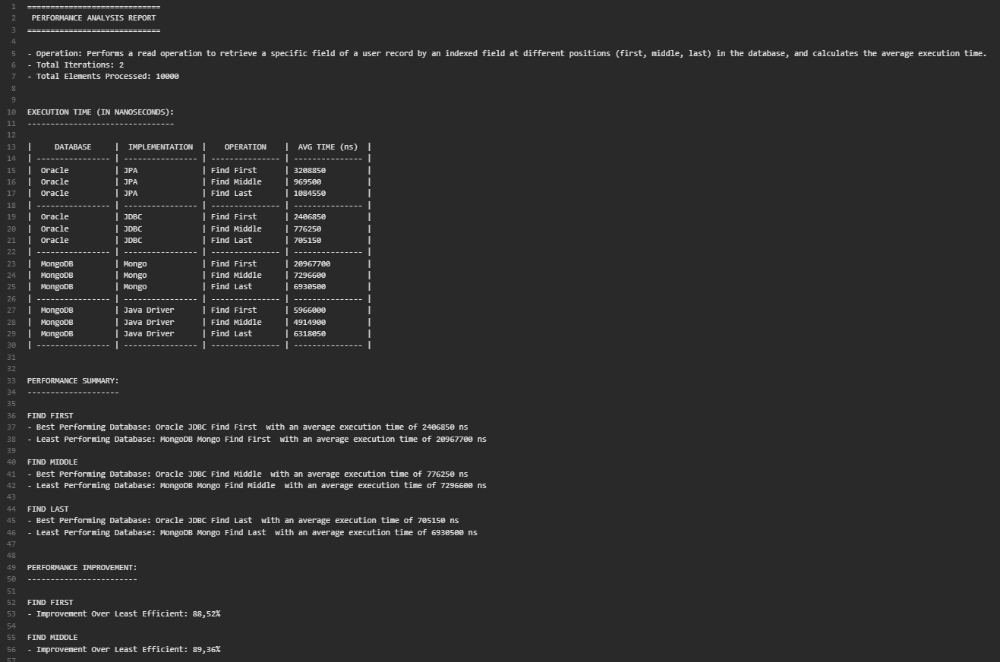


### **Compare Read Index And Non Index **
Performs a comparison of read operations by indexed and non-indexed fields at different positions (first, middle, last) in the database, and calculates the average execution time.
#### Request
```
[GET] http://localhost:8080/api/v1/performance/compareReadIndexAndNonIndex
```
#### Response
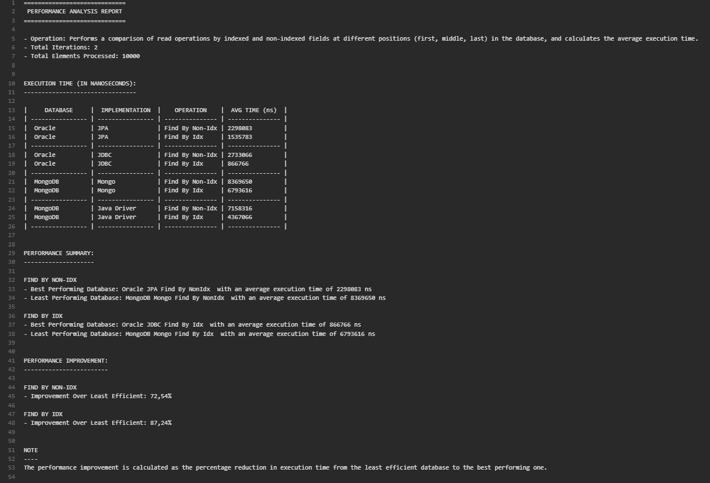

## Update Controller

### **Update All Users **
Performs a update operation to store a complete user record, and calculates the average execution time.
#### Request
```
[GET] http://localhost:8080/api/v1/performance/updateAllUsers
```
#### Response
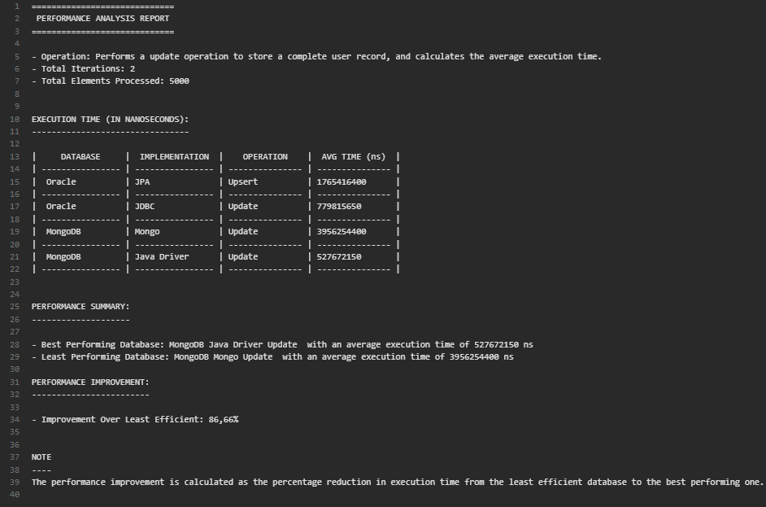

### **Update User By Id **
Performs a update operation to store a single user record by ID at different positions (first, middle, last), and calculates the average execution time.
#### Request
```
[GET] http://localhost:8080/api/v1/performance/updateUserById
```
#### Response
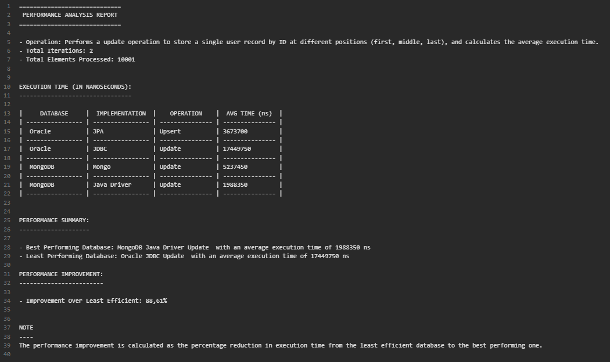

### **Update User By Indexed Field **
Performs a update operation to store a single user record by indexed field at different positions (first, middle, last), and calculates the average execution time.
#### Request
```
[GET] http://localhost:8080/api/v1/performance/updateUserByIndexedField
```
#### Response
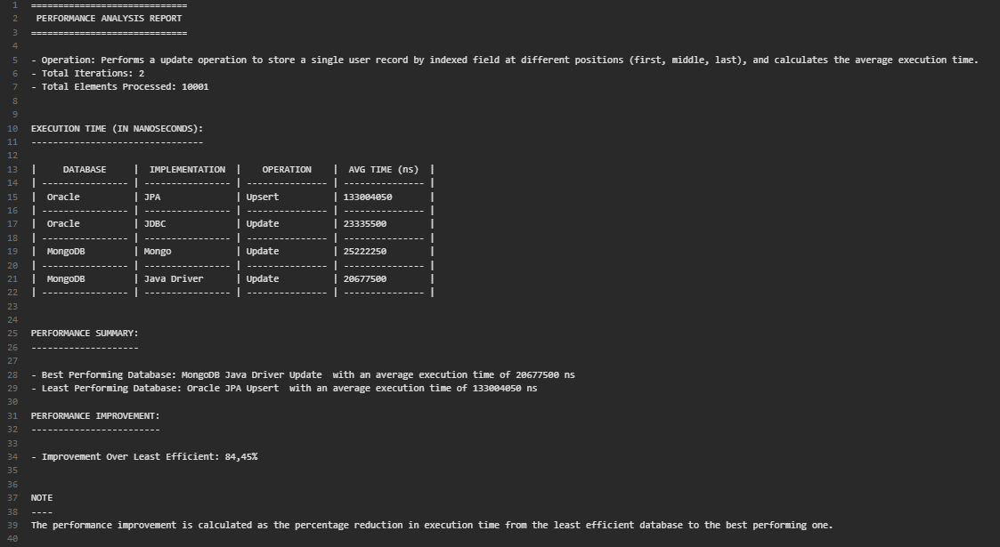

### **Update User By Non Indexed Field **
Performs a update operation to store a single user record by non-indexed field at different positions (first, middle, last), and calculates the average execution time.
#### Request
```
[GET] http://localhost:8080/api/v1/performance/updateUserByNonIndexedField
```
#### Response
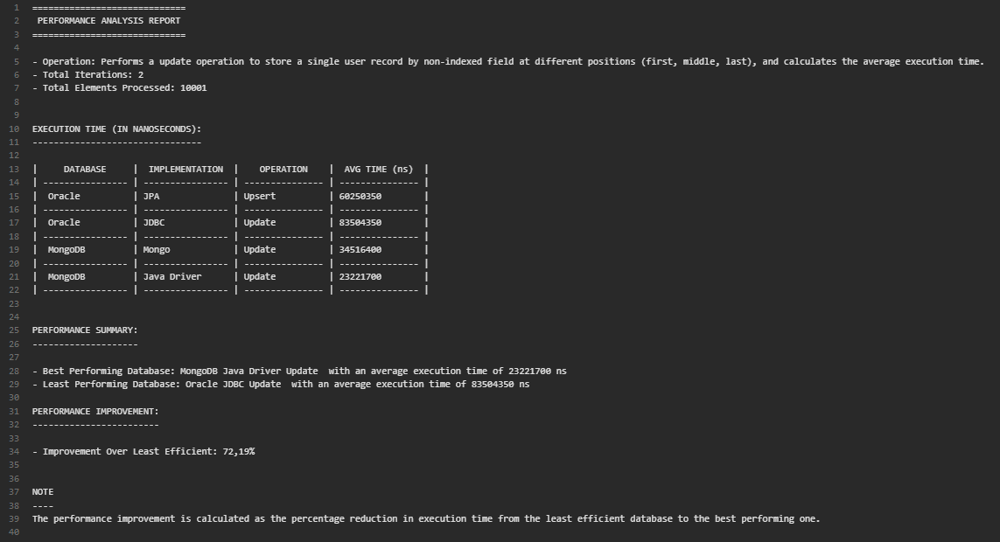

### **Compare Upsert Update **
Performs a comparison of upsert versus insert operations for user updating in the database, and calculates the average execution time.
#### Request
```
[GET] http://localhost:8080/api/v1/performance/compareUpsertUpdate
```
#### Response
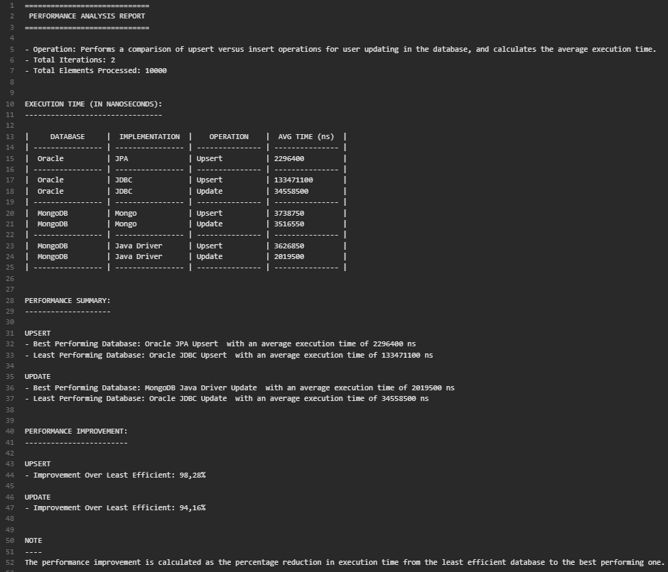

## Delete Controller

### **Delete All Users **
Performs a delete operation to remove a complete user record in a full database, and calculates the average execution time.
#### Request
```
[GET] http://localhost:8080/api/v1/performance/deleteAllUsers
```
#### Response
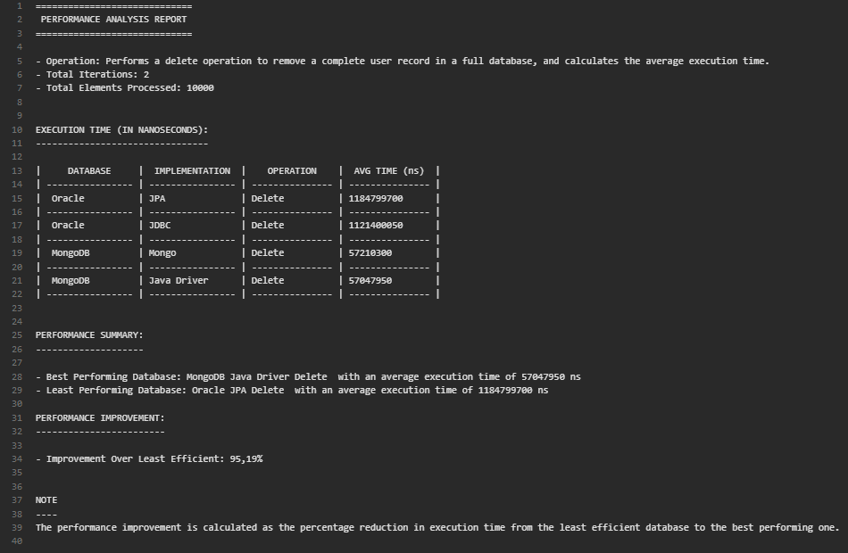

### **Delete User By Id **
Performs a delete operation to remove a complete user record by ID at different positions (first, middle, last) in the database, and calculates the average execution time.
#### Request
```
[GET] http://localhost:8080/api/v1/performance/deleteUserById
```
#### Response
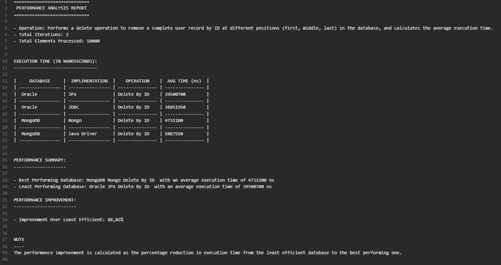

### **Delete User By Indexed Field **
Performs a delete operation to remove a complete user record by a indexed field at different positions (first, middle, last) in the database, and calculates the average execution time.
#### Request
```
[GET] http://localhost:8080/api/v1/performance/deleteUserByIndexedField
```
#### Response
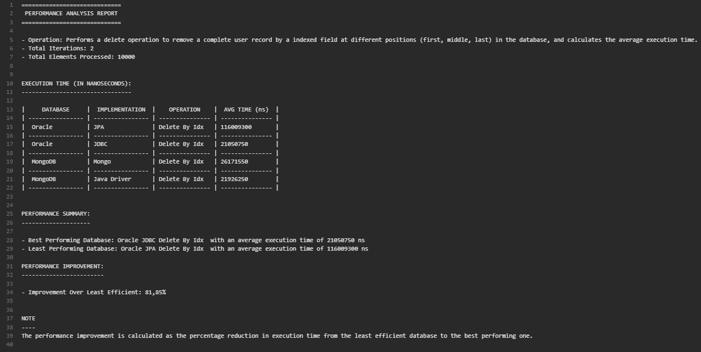

### **Delete User By Non Indexed Field **
Performs a delete operation to remove a complete user record by a non-indexed field at different positions (first, middle, last) in the database, and calculates the average execution time.
#### Request
```
[GET] http://localhost:8080/api/v1/performance/deleteUserByNonIndexedField
```
#### Response
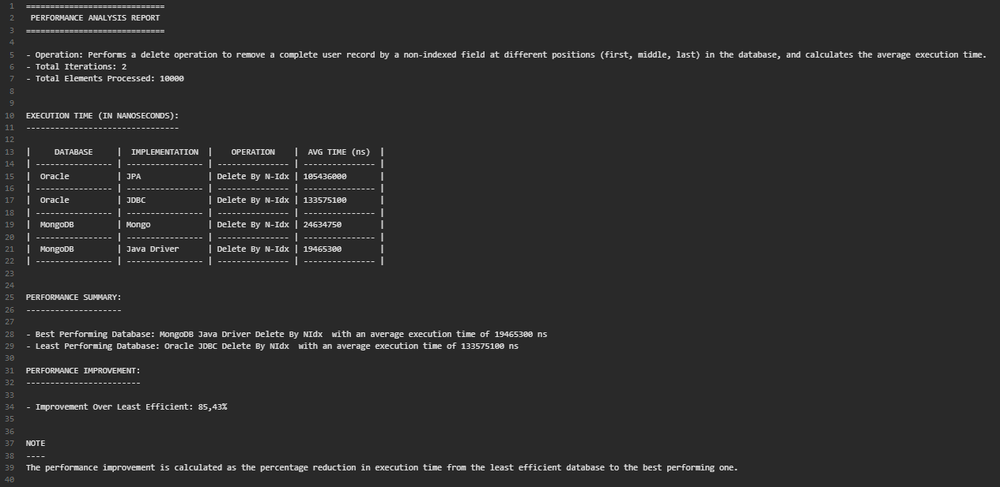

### **Compare Delete Index And Non Index **
Performs a comparison of delete operations by indexed and non-indexed fields at different positions (first, middle, last) in the database, and calculates the average execution time.
#### Request
```
[GET] http://localhost:8080/api/v1/performance/compareDeleteIndexAndNonIndex
```
#### Response
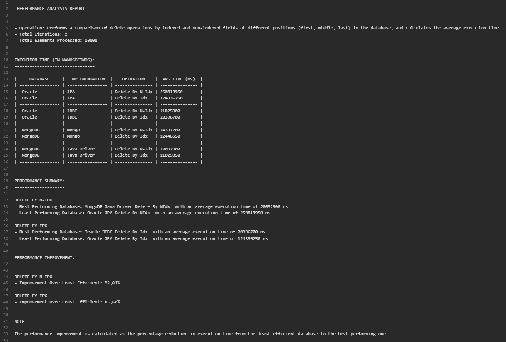

-------------------

## Docker Compose Setup

### Step 1: Install Docker Compose

Follow the official installation guide [here](https://docs.docker.com/compose/install/).

### Step 2: Understand the Docker Compose file

The `docker-compose.yml` file in this project defines two services: `mongodb_service` and `oracle_db_service`.

### Step 3: Run Docker Compose

Navigate to the directory containing the `docker-compose.yml` file in your terminal. Run the command `docker-compose up` to start the containers.

### Step 4: Verify the containers are running

You can use the command `docker ps` to list all running containers.

### Step 5: Interact with the databases

With the containers running, you can now interact with the databases.

### Step 6: Stop the containers

When you're done, you can stop the containers by running `docker-compose down` in the same directory as the `docker-compose.yml` file.
 
##### This will start all the services defined in the `docker-compose.yml` file. Docker Compose will pull the necessary images (if they're not already locally available), build your services, and then start them.
-----------

## Insomnia
This project includes an Insomnia export file, which contains all the predefined HTTP requests for interacting with the API.

To use it, follow these steps:

1. Install [Insomnia](https://insomnia.rest/download) if you haven't already.
2. Open Insomnia and select "Import/Export" in the menu.
3. Select "Import Data" > "From File".
4. Navigate to the `insomnia-export.json` file in the `insomnia` directory of this project and click "Open".

You should now see all the predefined HTTP requests in Insomnia, ready to be used.
-----------


