# Ecommerce
--------------
# Introduction

Spring Ecommerce is a prototype of an e-commerce application developed with Java and Spring Boot. It uses Maven as a project management tool and also includes JavaScript for certain client-side functionalities.

The application includes:
- All CRUD Operations.
- Rest API.
- User Interface.
- Management of products, users, orders and order details.
- Auth with JWT.
- User roles.
- Data persistence.
- Execution in Docker containers.
- File Uploads.
- Insomnia files.
---------------

## Contents

### RestApi
- [Products](#api-products)
- [Users](#api-users)
- [Orders](#api-orders)
- [Order Details](#api-order-details)
  
### Controllers
- [HomeController](#home-controller)
- [UserController](#user-controller)
- [AdminController](#admin-controller)
- [ProductController](#product-controller)

### Config
- [Docker](#docker)
- [Insomnia](#insomnia)
- [Swagger](#swagger)
-----------

## API Products
### **Get all products**
Fetch all products from the database including deleted ones.
#### Request
```
[GET] http://localhost:8080/api/v1/products
```
##### Response
```
{
  "id": 1,
  "name": "Product 1",
  "description": "Description for product 1",
  "price": 1.22,
  "quantity": 878,
  "reference": "Pcefc719-7bc2-4563-af87-d162fc0f0902",
  "deleted": false
},
```

### **Get all products paged**
Fetch all products from the database with pagination.
#### **Pagination Parameters**
| Parameter | Description |
| --------- | ----------- |
| `page`    | The number of the page to retrieve. Page numbers start at 0. |
| `size`    | The number of items to retrieve per page. |
| `sort`    | The field to sort the items by. This can be any field in the item entity. |
| `direction` | The direction to sort the items in. This can be 'asc' for ascending order or 'desc' for descending order. |
| `search`  | The term to filter the items by. This can be any part of the item's name or description. |
#### Request
```
[GET] http://localhost:8080/api/v1/products/paged?page=0&size=5&sort=id,asc
```
#### Response
```
{
	"content": [
		{
			"id": 2,
			"name": "Prot asds",
			"description": "Description for product 2",
			"price": 23.23,
			"quantity": 900,
			"reference": "P22d60fb-7885-4ed7-99b2-165e69d4a8aa",
			"deleted": false
		},
          ]
}
```

### **Get products by id**
Fetch products from the database by ID.
#### Request
```
[GET] http://localhost:8080/api/v1/products/id/17?id=17
```
#### Response
```json
{
	"id": 17,
	"name": "Product 17",
	"description": "Description for product 17",
	"price": 20.74,
	"quantity": 900,
	"reference": "P9c45f01-8e35-459f-b365-63f298837273",
	"deleted": false
}
```

### **Get products by partial reference**
Fetch products from the database by a partial reference.
#### Request
```
[GET] http://localhost:8080/api/v1/products/references/P1?reference=P1
```
#### Response
```json
{
	"id": 4,
	"name": "Product 4",
	"description": "Description for product 4",
	"price": 4.88,
	"quantity": 900,
	"reference": "P1d76de0-cf06-4ae5-b5b1-0b8603e0a980",
	"deleted": false
},
```

### **Get products by exact reference**
Fetch products from the database by a exact reference.
#### Request
```
[GET] http://localhost:8080/api/v1/products/references/P1?reference=P1
```
#### Response
```json
{
  "id": 4,
	"name": "Product 4",
	"description": "Description for product 4",
	"price": 4.88,
	"quantity": 900,
	"reference": "P1d76de0-cf06-4ae5-b5b1-0b8603e0a980",
	"deleted": false
},
```

### **Search products by name or reference**
Search products in the database by name or reference.
#### Request
```
[POST] http://localhost:8080/api/v1/products/search?searchTerm=10&searchType=name
```
#### Response
```json
{
	"id": 10,
	"name": "Product 10",
	"description": "Description for product 10",
	"price": 12.20,
	"quantity": 900,
	"reference": "P08f49e0-71f9-4f4d-a1cf-ad186a829cc1",
	"deleted": false
},
{
	"id": 100,
	"name": "Product 100",
	"description": "Description for product 100",
	"price": 122.00,
	"quantity": 900,
	"reference": "P89c94cc-f8a3-4b2e-9b93-4f523c289620",
	"deleted": false
}
```

### **Create a product**
Create a new product in the database.
#### Request
```
[POST] http://localhost:8080/api/v1/products/create
# Body
{
	"name": "Product 101",
	"description": "Description product 101",
	"price": "2.22",
	"quantity": "12"
}
```
#### Response
```
{
	"id": 101,
	"name": "Product 102",
	"description": "Description product 102",
	"price": 2.22,
	"quantity": 12,
	"reference": "P2fe72ae-640e-48b0-878a-3f961b7ecee7",
	"deleted": false
}
```

### **Update a product**
Update an existing product in the database.
#### Request
```
[PUT] http://localhost:8080/api/v1/products/update
# Body
{
	"id": "2",
	"name": "Product 102",
  "description": "Description for product 102",
	"price": "23.23",
	"deleted": false
}
```
#### Response
```json
{
	"id": 2,
	"name": "Product 102",
	"description": "Description for product 102",
	"price": 23.23,
	"quantity": 900,
	"reference": "P1d76de0-cf06-4ae5-b5b1-0b8603e0a980",
	"deleted": false
}
```

### **Delete a product**
Delete a product from the database.
#### Request
```
[DEL] http://localhost:8080/api/v1/products/delete/1?id=1
```
#### Response
```
200 OK
```

## API Users
### **Get all users**
Fetch all users from the database.
#### Request
```
[GET] http://localhost:8080/api/v1/users
```
#### Response
```
200 OK
```

### **Get all users paged**
Fetch all users from the database with pagination.
#### **Pagination Parameters**
| Parameter | Description |
| --------- | ----------- |
| `page`    | The number of the page to retrieve. Page numbers start at 0. |
| `size`    | The number of items to retrieve per page. |
| `sort`    | The field to sort the items by. This can be any field in the item entity. |
| `direction` | The direction to sort the items in. This can be 'asc' for ascending order or 'desc' for descending order. |
| `search`  | The term to filter the items by. This can be any part of the item's name or description. |
#### Request
```
[GET] http://localhost:8080/api/v1/users/paged?page=0&size=5&sort=id,asc
```
#### Response
```
{
	"content": [
		{
			"id": 1,
			"username": "username1",
			"email": "email1@example.com",
			"name": "name1",
			"address": "address 1",
			"phoneNumber": "001",
			"authorities": [
				{
					"authority": "ROLE_ADMIN"
				}
		},
          ]
}
```

### **Get user by ID**
Fetch a user from the database by its ID.
#### Request
```
[GET] http://localhost:8080/api/v1/users/id/17?id=17
```
#### Response
```
{
	"id": 17,
	"username": "username17",
	"email": "email17@example.com",
	"name": "name17",
	"address": "address 17",
	"phoneNumber": "0017",
	"authorities": [
		{
			"authority": "ROLE_USER"
		}
	]
}
```

### **Check if user is admin from JWT**
Check if the current user is an admin from JWT.
#### Request
```
[GET] http://localhost:8080/api/v1/users/is-admin
```
#### Response
```
true
```

### **Get current user Id from JWT**
Fetch the ID of the current user from JWT.
#### Request
```
[GET] http://localhost:8080/api/v1/users/id-from-token
```
#### Response
```
1
```

### **Get token expiration date**
Fetch the expiration date of the current token.
#### Request
```
[GET] http://localhost:8080/api/v1/users/expire-token
```
#### Response
```
Token expiration date: 9 minutes
```

### **User login**
Login a user with username and password.
#### Request
```
[POST] http://localhost:8080/api/v1/users/login?username=username1&password=123
```
#### Response
```
{
	"id": 1,
	"username": "username1",
	"email": "email1@example.com",
	"name": "name1",
	"address": "address 1",
	"phoneNumber": "001",
	"authorities": [
		{
			"authority": "ROLE_ADMIN"
		}
	]
}
```

### **User logout**
Logout the current user.
#### Request
```
[POST] http://localhost:8080/api/v1/users/logout
```
#### Response
```
200 OK
```

### **Create a user**
Create a new user in the database.
#### Request
```
[POST] http://localhost:8080/api/users/create
# Body
{
	"name": "borja",
	"username": "borjaserrano",
	"password": "123",
	"email": "ff@ff.c",
	"address": "123456",
	"phoneNumber": "123456"
}
```
#### Response
```
{
	"id": 51,
	"username": "borjaserrano",
	"email": "ff@ff.c",
	"name": "borja",
	"address": "123456",
	"phoneNumber": "123456",
	"authorities": [
		{
			"authority": "ROLE_USER"
		}
	]
}
```

### **Delete a user**
Delete a user from the database by its ID.
#### Request
```
[DEL] http://localhost:8080/api/v1/users/delete/11?id=51
```
#### Response
```
200 OK
```

## API Orders
### **Get all orders**
Fetch all orders from the database.
#### Request
```
[GET] http://localhost:8080/api/v1/orders
```
#### Response
```
{
		"id": 1,
		"reference": "Db0d6cd6-ded4-490c-a31a-ab6e97ffbdb0",
		"creationDate": "2024-01-21T00:00:00.000+00:00",
		"receivedDate": "2024-01-21T00:00:00.000+00:00",
		"total": 825.94,
		"userId": 49,
		"orderDetails": [
			{
				"id": 1,
				"quantity": 1,
				"total": 84.18,
				"product": {
					"id": 69,
					"name": "Product 69",
					"description": "Description for product 69",
					"price": 84.18,
					"quantity": 900,
					"reference": "Pa96d607-4484-42bd-aad2-afaa98ad2b65",
					"deleted": false
				}
			},
			{
				"id": 2,
				"quantity": 2,
				"total": 41.48,
				"product": {
					"id": 17,
					"name": "Product 17",
					"description": "Description for product 17",
					"price": 20.74,
					"quantity": 900,
					"reference": "Pc00db48-3259-44c0-8e9f-68e33b8b3800",
					"deleted": false
				}
			},
]
}
```

### **Get all orders paged**
Fetch all orders from the database with pagination.
#### **Pagination Parameters**
| Parameter | Description |
| --------- | ----------- |
| `page`    | The number of the page to retrieve. Page numbers start at 0. |
| `size`    | The number of items to retrieve per page. |
| `sort`    | The field to sort the items by. This can be any field in the item entity. |
| `direction` | The direction to sort the items in. This can be 'asc' for ascending order or 'desc' for descending order. |
| `search`  | The term to filter the items by. This can be any part of the item's name or description. |
#### Request
```
[GET] http://localhost:8080/api/v1/orders/paged?page=1&size=5&sort=id,asc
```
#### Response
```
{
	"content": [
		{
			"id": 6,
			"reference": "D9ffbb3d-5275-46f8-a134-8aac97e39147",
			"creationDate": "2024-01-21T00:00:00.000+00:00",
			"receivedDate": "2024-01-21T00:00:00.000+00:00",
			"total": 3193.96,
			"userId": 28,
			"orderDetails": [
				{
					"id": 26,
					"quantity": 26,
					"total": 761.28,
					"product": {
						"id": 24,
						"name": "Product 24",
						"description": "Description for product 24",
						"price": 29.28,
						"quantity": 900,
						"reference": "Pce25057-bd71-431b-ba88-6f7ff7402e10",
						"deleted": false
					}
				},
]}]}

```

### **Get order by ID**
Fetch a order from the database by its ID.
#### Request
```
[GET] http://localhost:8080/api/v1/orders/id/14?id=14
```
#### Response
```
{
	"id": 14,
	"reference": "D7228c9b-fc4d-4ea7-b3da-a48cc07ebead",
	"creationDate": "2024-01-21T00:00:00.000+00:00",
	"receivedDate": "2024-01-21T00:00:00.000+00:00",
	"total": 21869.72,
	"userId": 3,
	"orderDetails": [
		{
			"id": 66,
			"quantity": 66,
			"total": 6119.52,
			"product": {
				"id": 76,
				"name": "Product 76",
				"description": "Description for product 76",
				"price": 92.72,
				"quantity": 900,
				"reference": "P0492054-1404-47c9-9de2-23c8a1c96742",
				"deleted": false
			}
		},
]}
```

### **Get order by reference**
Fetch an order from the database by its reference.
#### Request
```
[GET] http://localhost:8080/api/v1/orders/reference/D7228c9b-fc4d-4ea7-b3da-a48cc07ebead?reference=D7228c9b-fc4d-4ea7-b3da-a48cc07ebead
```
#### Response
```
{
	"id": 14,
	"reference": "D7228c9b-fc4d-4ea7-b3da-a48cc07ebead",
	"creationDate": "2024-01-21T00:00:00.000+00:00",
	"receivedDate": "2024-01-21T00:00:00.000+00:00",
	"total": 21869.72,
	"userId": 3,
	"orderDetails": [
		{
			"id": 66,
			"quantity": 66,
			"total": 6119.52,
			"product": {
				"id": 76,
				"name": "Product 76",
				"description": "Description for product 76",
				"price": 92.72,
				"quantity": 900,
				"reference": "P0492054-1404-47c9-9de2-23c8a1c96742",
				"deleted": false
			}
		}
]}
```

### **Get orders by user ID**
Fetch all orders from the database for a specific user.
#### Request
```
[GET] http://localhost:8080/api/v1/orders/user-id/23?userId=23
```
#### Response
```
[
	{
		"id": 27,
		"reference": "D2e012ab-a093-4d5c-aa06-5dd8954a91d2",
		"creationDate": "2024-01-21T00:00:00.000+00:00",
		"receivedDate": "2024-01-21T00:00:00.000+00:00",
		"total": 47593.42,
		"userId": 23,
		"orderDetails": [
			{
				"id": 131,
				"quantity": 131,
				"total": 12785.60,
				"product": {
					"id": 80,
					"name": "Product 80",
					"description": "Description for product 80",
					"price": 97.60,
					"quantity": 900,
					"reference": "Pb130e42-cd15-42cc-a30f-fe0b67638c76",
					"deleted": false
				}
			}
]}
```

### **Delete order by ID**
Delete an order from the database by its ID and respective orderdetails.
#### Request
```
[DEL] http://localhost:8080/api/v1/orders/delete/id/12?id=12
```
#### Response
```
200 OK
```

## API Order Details
### **Get all order details**
Fetch all order details from the database.
#### Request
```
[GET] http://localhost:8080/api/v1/orders-details
```
#### Response
```
{
		"id": 1,
		"quantity": 1,
		"total": 84.18,
		"product": {
			"id": 69,
			"name": "Product 69",
			"description": "Description for product 69",
			"price": 84.18,
			"quantity": 900,
			"reference": "Pa96d607-4484-42bd-aad2-afaa98ad2b65",
			"deleted": false
		},
```

### **Get all order details paged**
Fetch all order details from the database with pagination.
#### **Pagination Parameters**
| Parameter | Description |
| --------- | ----------- |
| `page`    | The number of the page to retrieve. Page numbers start at 0. |
| `size`    | The number of items to retrieve per page. |
| `sort`    | The field to sort the items by. This can be any field in the item entity. |
| `direction` | The direction to sort the items in. This can be 'asc' for ascending order or 'desc' for descending order. |
| `search`  | The term to filter the items by. This can be any part of the item's name or description. |
#### Request
```
[GET] http://localhost:8080/api/v1/orders-details/paged?page=0&size=5&sort=id,asc
```
#### Response
```
{
	"content": [
		{
			"id": 1,
			"quantity": 1,
			"total": 34.16,
			"product": {
				"id": 28,
				"name": "Product 28",
				"description": "Description for product 28",
				"price": 34.16,
				"quantity": 900,
				"reference": "Pba659b3-5ba1-437e-9404-962afb7839e7",
				"deleted": false
			}
		},
		{
			"id": 2,
			"quantity": 2,
			"total": 178.12,
			"product": {
				"id": 73,
				"name": "Product 73",
				"description": "Description for product 73",
				"price": 89.06,
				"quantity": 900,
				"reference": "Pae85498-5ab7-47c1-b040-7930adc378fb",
				"deleted": false
			}
		},
]
}
```

### **Get order details by ID**
Fetch order details from the database by its ID.
#### Request
```
[GET] http://localhost:8080/api/v1/users/id/17?id=17
```
#### Response
```
{
	"id": 17,
	"quantity": 17,
	"total": 1078.48,
	"product": {
		"id": 52,
		"name": "Product 52",
		"description": "Description for product 52",
		"price": 63.44,
		"quantity": 900,
		"reference": "P4bf1e0e-830a-4bb2-89b6-a5cc23fe82d7",
		"deleted": false
	}
}
```

### **Get product and stock in current cart**
Fetch a product and its stock in the current cart.
#### Request
```
[GET] http://localhost:8080/api/v1/users/is-admin
```
#### Response
```
true
```

### **Get cart and total price**
Fetch the ID of the current user from JWT.
#### Request
```
[GET] http://localhost:8080/api/v1/product/stock/3?productId=3
```
#### Response
```
{
	"ProductDto{id= 3, name= 'Product 3', description= 'Description for product 3', quantity= 900, price= 3.66}": 878
}
```

### **Get cart and total price**
Fetch the current cart and its total price.
#### Request
```
[GET] http://localhost:8080/api/v1/users/expire-token
```
#### Response
```
{
	"[ProductDto{id= 3, name= 'Product 3', description= 'Description for product 3', quantity= 22, price= 80.52}]": 80.52
}
```

### **Add product to cart**
Add a product to the cart.
#### Request
```
[POST] http://localhost:8080/api/v1/cart/add?productId=3&productQuantity=22
```
#### Response
```
{
	"id": 3,
	"name": "Product 3",
	"description": "Description for product 3",
	"price": 80.52,
	"quantity": 22,
	"reference": "Pf666c6a-957c-4545-aaaa-3094aaf40182",
	"deleted": false
}
```

### **Confirm purchase and create order**
Confirm the purchase and create an order.
#### Request
```
[POST] http://localhost:8080/api/v1/users/logout
```
#### Response
```
{
	"id": 41,
	"reference": "D24d35cc-c2dd-4e4b-8dca-7e1c9875b15f",
	"creationDate": "2024-01-21",
	"receivedDate": null,
	"total": 80.52,
	"userId": 1,
	"orderDetails": [
		{
			"id": 201,
			"quantity": 22,
			"total": 80.52,
			"product": {
				"id": 3,
				"name": "Product 3",
				"description": "Description for product 3",
				"price": 3.66,
				"quantity": 878,
				"reference": "Pf666c6a-957c-4545-aaaa-3094aaf40182",
				"deleted": false
			}
		}
	]
}
```

### **Remove product from cart**
Remove a product from the cart.
#### Request
```
[DEL] http://localhost:8080/api/v1/users/delete/11?id=51
```
#### Response
```
200 OK
```
----------------

## Home Controller

The `HomeController` handles web requests related to the home page and shopping cart operations.

### Home
Displays the home page with all available products.
#### Request
```
[GET] http://localhost:8080
```
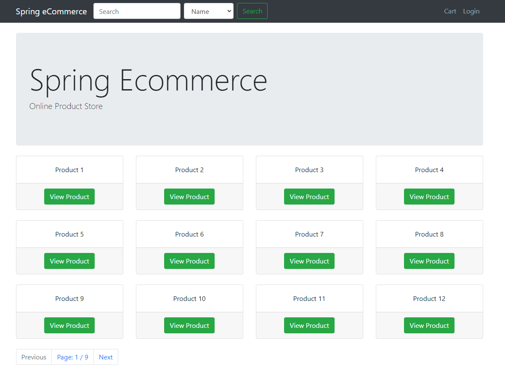

### Show Product by ID
Displays the details of a specific product.
#### Request
```
[GET] http://localhost:8080/product/{id}
```
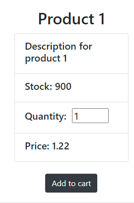

### Add product to cart
Adds a product to the user's shopping cart.
#### Request
```
[POST] http://localhost:8080/add-to-cart
```

### Show cart
Displays the user's shopping cart.
#### Request
```
[GET] http://localhost:8080/cart
```
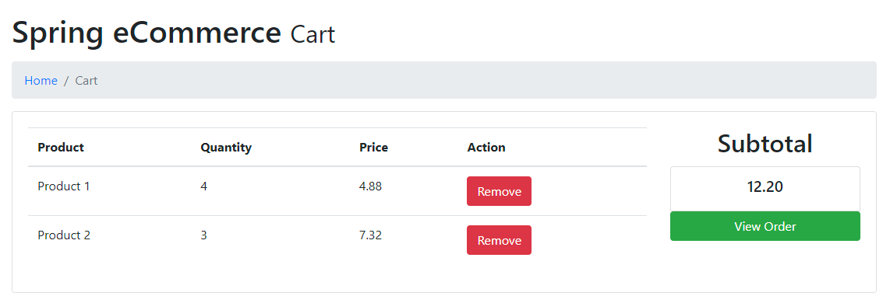

### Delete product from cart
Removes a product from the user's shopping cart.
#### Request
```
[POST] http://localhost:8080/delete-cart-product/{productId}
```

### Confirm purchase and sabe order details
Confirms the purchase and saves the order details.
#### Request
```
[POST] http://localhost:8080/purchase-confirm
```

### Order Summary
Displays the user's order summary.
#### Request
```
[GET] http://localhost:8080/order-summary
```
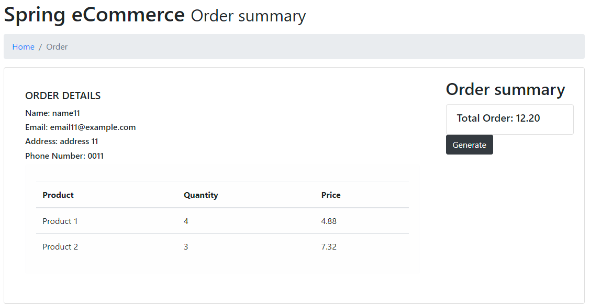

### Search Product
Searches for products by name or reference.
#### Request
```
[POST] http://localhost:8080/product-search
```


##### Please replace `{id}` and `{productId}` with the corresponding product ID.
-----------

## User Controller

The `UserController` handles web requests related to user management.

### Create user
Displays the user creation page.
#### Request
```
[GET] http://localhost:8080/user/create
```
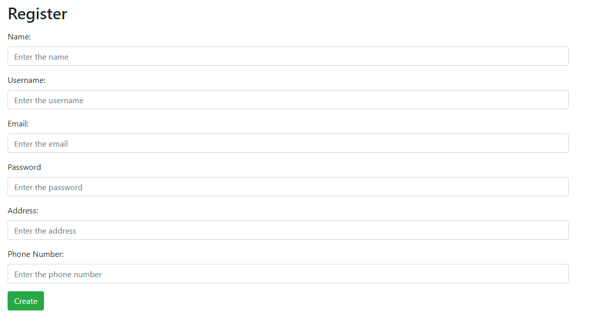

### Save user
Saves a new user.
#### Request
```
[POST] http://localhost:8080/user/save
```

### Login user
Displays the user login page.
#### Request
```
[GET] http://localhost:8080/user/login
```


### Authenticate user
Authenticates a user.
#### Request
```
[POST] http://localhost:8080/user/authenticate
```

### Logout user
Logs out a user.
#### Request
```
[POST] http://localhost:8080/user/logout
```
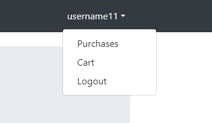

### Purchases of user
Displays the purchases of a user.
#### Request
```
[GET] http://localhost:8080/user/purchases
```
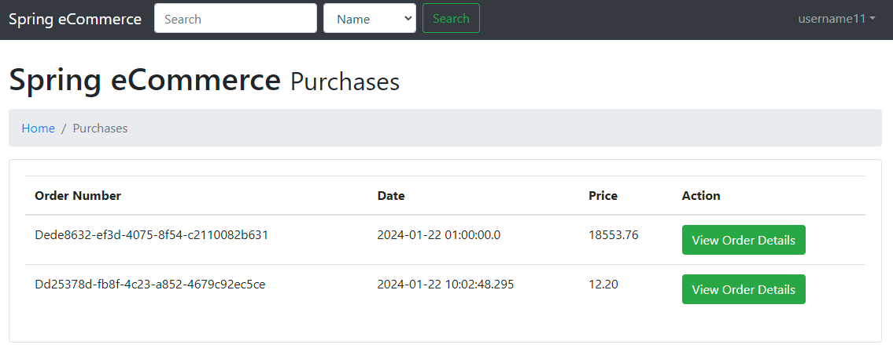

### Purchase details of user
Displays the details of a specific purchase.
#### Request
```
[GET] http://localhost:8080/user/purchase-details/{id}
```
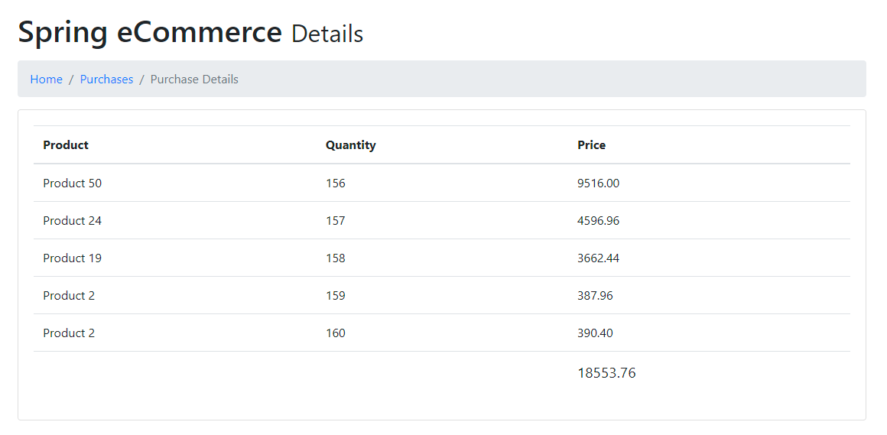

##### Please replace `{id}` with the corresponding purchase ID.
----------

## Admin Controller
The `AdminController` handles web requests related to product management, orders, and users.

### Home View
Displays the admin home page with all available products.
#### Request
```
[GET] http://localhost:8080/admin
```
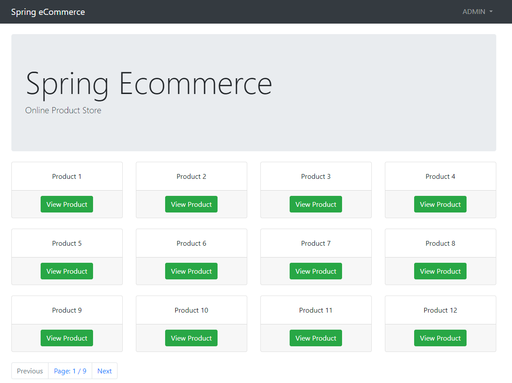

### Product Home View
Displays the details of a specific product.
#### Request
```
[GET] http://localhost:8080/admin/product/{id}
```


### Products View
Displays all available products.
#### Request
```
[GET] http://localhost:8080admin/products
```
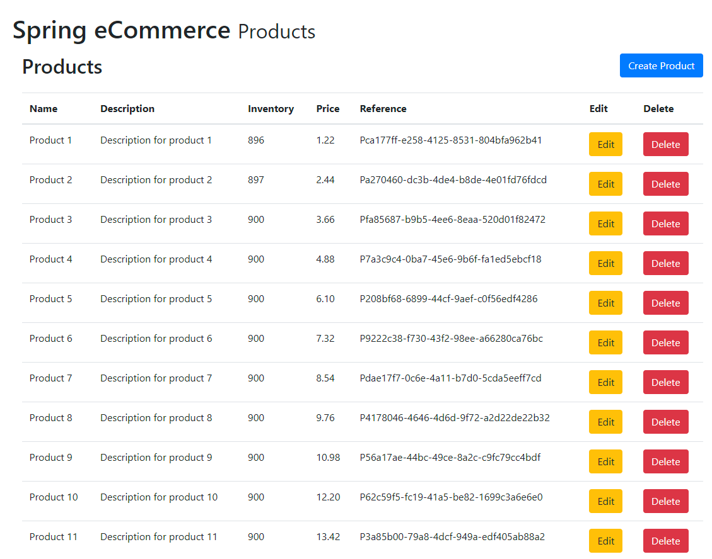

### Orders View
Displays all the orders placed.
#### Request
```
[GET] http://localhost:8080/admin/orders
```
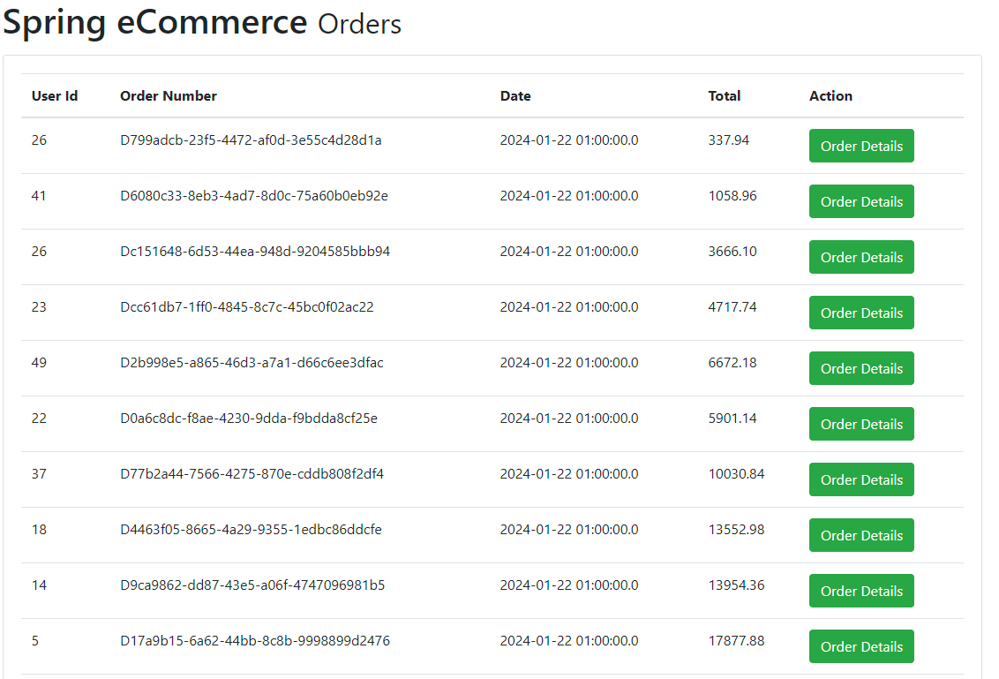

### Order Details View
Displays the details of a specific order.
#### Request
```
[GET] http://localhost:8080/admin/order/{id}
```
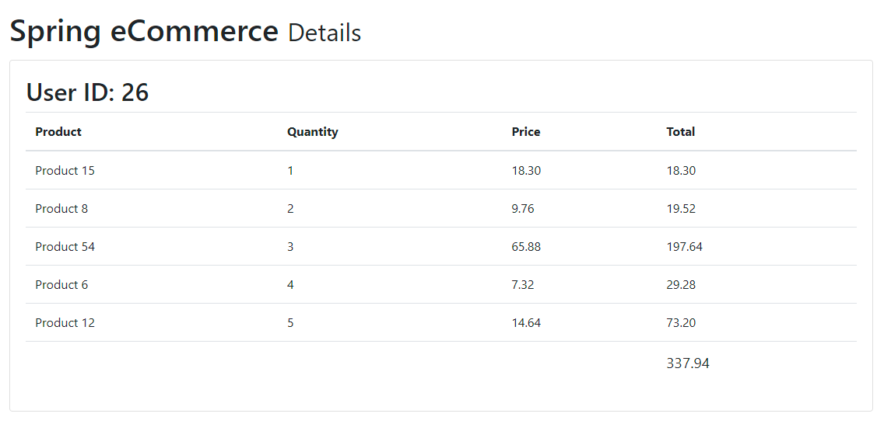

### Users View
Displays all registered users.
#### Request
```
[GET] http://localhost:8080/admin/users
```
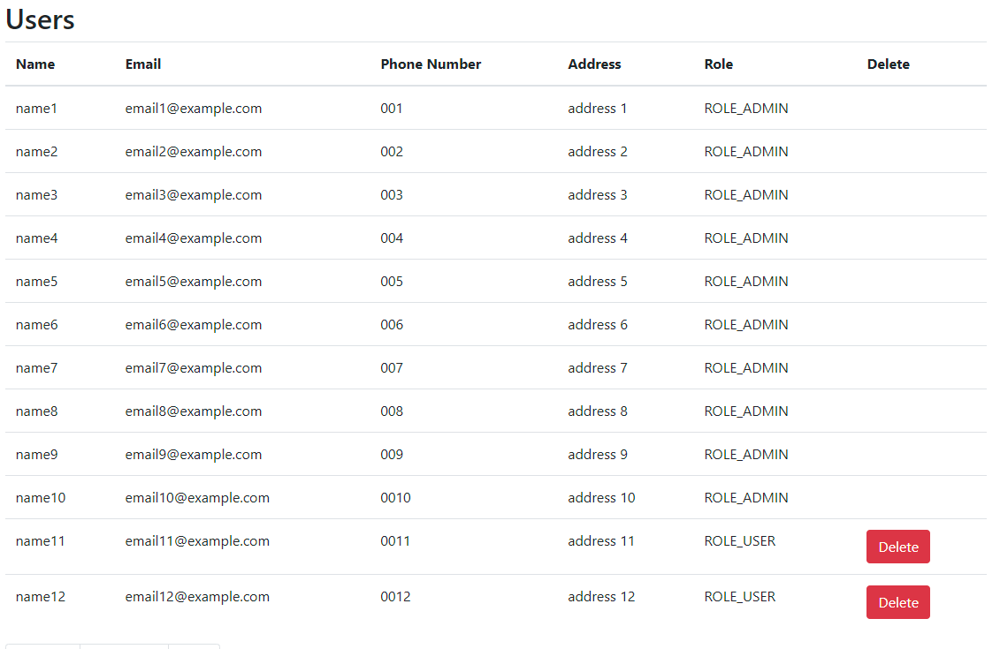

### Delete User
Deletes a specific user.
#### Request
```
[POST] http://localhost:8080/admin/user/delete/{id}
```

##### Please replace `{id}` with the corresponding product or order ID.
------------

## Product Controller
The `ProductController` handles web requests related to product management.

### Create product
Displays the product creation page.
#### Request
```
[GET] http://localhost:8080/product/create
```


### Edit product
Displays the product editing page for a specific product.
#### Request
```
[GET] http://localhost:8080/product/edit/{id}
```


### Save product
Saves a new product.
#### Request
```
[POST] http://localhost:8080/product/save
```

### Update product
Updates an existing product.
#### Request
```
[POST] http://localhost:8080/product/update
```

### Delete Product
Deletes a specific product.
#### Request
```
[POST] http://localhost:8080/product/delete/{id}
```


##### Please replace `{id}` with the corresponding product ID.
-------------------

## Docker
In this project, we use Docker and Docker Compose to simplify the deployment process and ensure consistent behavior across different environments.

Docker is a platform that allows us to "containerize" our application, which means packaging the application along with all its related configuration files, libraries, and dependencies required for it to run. This ensures that the application will run the same, regardless of the environment it is running in.

Docker Compose is a tool for defining and running multi-container Docker applications. With Compose, we use a YAML file (docker-compose.yml) to configure our application's services, and then create and start all the services from this configuration.

In our `docker-compose.yml` file, we define two services:

1. `app`: This is our main application, built using the Dockerfile in the project root. It runs on port 8080 and depends on the `db` service being available.

2. `db`: This is a MySQL database, running on port 3306. The database is initialized with a root password and a database named 'ecommerce'.

To run the application, you'll need to have Docker and Docker Compose installed on your machine. Once you have those installed, follow these steps:

1. Make sure you have Docker and Docker Compose installed. You can check by running `docker --version`.
2. Open your terminal. Navigate to the project directory (the directory containing the `docker-compose.yml` file).
3. Run the command `docker-compose up`.
 
##### This will start all the services defined in the `docker-compose.yml` file. Docker Compose will pull the necessary images (if they're not already locally available), build your services, and then start them.
##### Now, the application and all its services should be running. You can access the application at `http://localhost:8080`.
-----------

## Insomnia
This project includes an Insomnia export file, which contains all the predefined HTTP requests for interacting with the API.

To use it, follow these steps:

1. Install [Insomnia](https://insomnia.rest/download) if you haven't already.
2. Open Insomnia and select "Import/Export" in the menu.
3. Select "Import Data" > "From File".
4. Navigate to the `insomnia-export.json` file in the `insomnia` directory of this project and click "Open".

You should now see all the predefined HTTP requests in Insomnia, ready to be used.
-----------

## Swagger
To access the Swagger documentation through the user interface, you can navigate to the following URL in your browser:
#### Request
```
[GET] http://localhost:8080/swagger-ui.html
```
On the other hand, to access the Swagger documentation in JSON format, you can navigate to the following URL:
#### Request
```
[GET] http://localhost:8080/v3/api-docs
```


